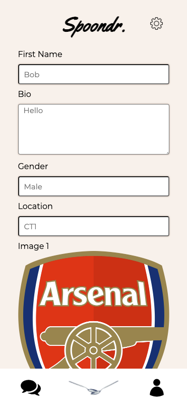
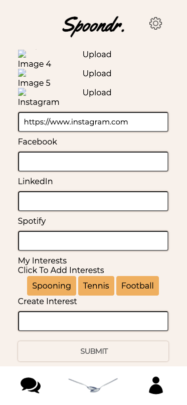
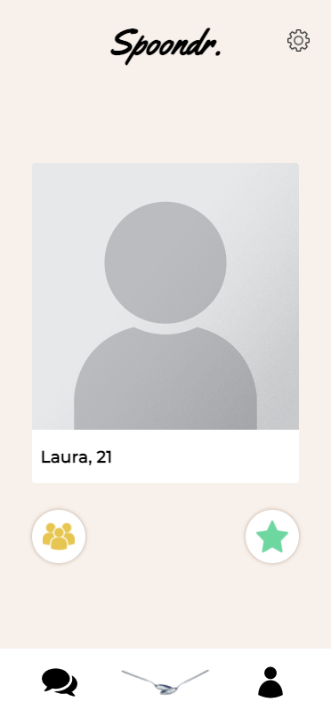

### General Assembly Software Engineering Immersive 
# Project 4 - Spoondr

## The Overview
This was the fourth and final project of the General Assembly Course. We were set in a group of 3 people, luckily we all had our individual interests that lined up perfectly. 

This project was all about using a Python and Flask backend, something none of us had ever done before. Like our third project, we had to create our own API and use an external one if needed, however, we did not need to use any other API's. The frontend was built as usual with ReactJS and Sass.

You can view our project here --> ***[Spoondr](https://spoondr-project.herokuapp.com/)*** 

### What is Spoondr?
Spoondr is a dating app, similar to Tinder, but instead of looking for people to date, you are looking for people to spoon with. You can create and edit your profile, state which gender you are searching for (or you can swipe through all genders) and chat with your matches.

### Technologies Used

- Python
- Flask
- PostgreSQL
- ReactJS
- Sass
- Heroku (for deployment)
- Git & GitHub

## The App
There wasn't one standout leader in our group, we all distributed tasks together and pinpointed issues we had faced in previous group tasks. One of these issues was the styling being all over the place from page to page, so one of my team members took on the task of styling for the whole app as well as the login and register pages. 

My other teammate and I took on the backend and the main swipe page together. We then split up for the rest of the frontend. The pages I worked on were the edit profile and settings page.

## Our API
With this being our first time working with Python and Flask unguided, the backend was a struggle, especially as we were adding a chat functionality on the frontend. 

Here is a sample response when GETting a user:

```json
{
	"age": 22,
	"bio": "Hi, please can someone spoon me?",
	"created_at": "2020-12-04 14:30:22",
	"first_name": "Harry",
	"id": 1,
  	"images": [
		{
       	"created_at": "2020-12-04 14:30:22",
        	"id": 1,
        	"image1": "https://res.cloudinary.com/spoondr/image/upload/v1606992150/another_harry_qityxz.jpg",
        	"image2": null,
        	"image3": null,
        	"image4": null,
        	"image5": null,
        	"updated_at": "2020-12-04 14:30:22"
      	}
	],
 	"interests": [
    	{
        	"created_at": "2020-12-04 14:30:22",
        	"id": 1,
        	"name": "Spooning",
        	"updated_at": "2020-12-04 14:30:22"
      	}
  	],
 	"location": "CT1",
 	"matches": [
   		{
        	"Liked": [
          	1,
          	2,
          	3
     		],
        	"LikedBy": [],
        	"Matched": [],
        	"created_at": "2020-12-04 14:30:22",
        	"id": 1,
        	"updated_at": "2020-12-04 14:31:18"
      	}
 	],
	"socials": [
  		{
        	"Facebook": null,
        	"Instagram": "https://www.instagram.com/harrytxdd/",
        	"LinkedIn": null,
        	"Spotify": null,
        	"created_at": "2020-12-04 14:30:22",
        	"id": 1,
        	"updated_at": "2020-12-04 14:30:22"
      	}
 	],
 	"updated_at": "2020-12-04 14:30:22"
}
```
### Models
Below is an example of our user model:

```python
class User(db.Model, BaseModel):
	__tablename__ = 'users'

  	id = db.Column(db.Integer, primary_key=True)
  	first_name = db.Column(db.String(50), nullable=False, unique=True)
  	email = db.Column(db.String(128), nullable=False, unique=True)
  	bio = db.Column(db.String(128), nullable=True)
  	password_hash = db.Column(db.String(128), nullable=True)
  	location = db.Column(db.String(30), nullable=False)
  	age = db.Column(db.Integer, nullable=False)
  	gender = db.Column(db.String(10), nullable=False)
  	gender_preference = db.Column(db.String(10), nullable=False)
  	interests = db.relationship('Interests', secondary=user_interests_join, backref='users')
  	socials = db.relationship('Socials', secondary=user_socials_join, backref='users')
  	images = db.relationship('Images', secondary=user_images_join, backref='users')
  	matches = db.relationship('Matches', secondary=user_matches_join, backref='users')
  	chats = db.relationship('Chats', secondary=user_chats_join, backref='users')

  	@hybrid_property
  	def password(self):
    	pass

  	@password.setter
  	def password(self, password_plaintext):
    	self.password_hash = bcrypt.generate_password_hash(password_plaintext).decode('utf-8')

  	def validate_password(self, password_plaintext):
    	return bcrypt.check_password_hash(self.password_hash, password_plaintext)

  	def generate_token(self):
    	payload = { 
      		'exp': datetime.utcnow() + timedelta(days=1),
      		'iat': datetime.utcnow(),
      		'sub': self.id
    	}
    	token = jwt.encode(payload, secret, 'HS256').decode('utf-8')

    	return token
```
As you can see, we have used quite a few referenced relationships. 

Our interests model and join table are below:

##### Model
```python
class Interests(db.Model, BaseModel):
 	__tablename__ = 'interests'
  	name = db.Column(db.String(40), unique=True, nullable=True)
```
##### Join Table
```python
user_interests_join = db.Table('user_interests',
  	db.Column('interest_id', db.Integer, db.ForeignKey('interests.id'), primary_key=True),
  	db.Column('user_id', db.Integer, db.ForeignKey('users.id'), primary_key=True)
)
```

### Controllers

To keep everything structured and easy to navigate, we gave each of our models their own controller. Here is an example of our '/signup' route for our user:

```python
@router.route('/signup', methods=['POST'])
def signup():
  	user = user_schema.load(request.get_json())
  	
  	template_images = Images(
    	image1='https://res.cloudinary.com/spoondr/image/upload/v1607006914/Portrait_Placeholder_zu9uoa.png'
  	)
    	
  	template_social= Socials(
    	Instagram ='https://www.instagram.com'
  	)
  
  	user.images = [template_images]
  	user.socials = [template_social]
  	user.save()

  	template_match = Matches(
    	Liked=[user.id],
    	LikedBy=[],
    	Matched=[],
    	Disliked=[]
  	)
  	
  	user.matches.append(template_match)
  	user.save()
  	
  	return user_schema.jsonify(user), 200
```
In order to avoid conflicts, we preset the user with a default profile photo, default Instagram link and add themselves to their liked array (this was the easiest way we could find to ensure you cannot swipe your own profile).

### Extra Backend Features
Similar to my Clique project, we added in some middleware to add a little more security to our app. This checks if there is a valid token being used to access the backend data. See below:

```python
def secure_route(func):
  	@wraps(func)
  	def wrapper(*args, **kwargs):
    	raw_token = request.headers['Authorization']
    	clean_token = raw_token.replace('Bearer ', '')

    	try:
      		payload = jwt.decode(clean_token, secret)
      		user_id = payload['sub']
      		user = User.query.get(user_id)

      		if not user:
        	return { 'message': 'Unauthorised, please login' }, 401
      
      		g.current_user = user
    
		except jwt.ExpiredSignatureError:
      		return { 'message': 'Unauthorised, login expired' }, 401
    
  		except Exception as e:
      		return { 'message': 'Unauthorised' }, 401

  		return func(*args, **kwargs)

	return wrapper
```
We added various messages so that we know where the error has occurred (e.g. "Unauthorised, please login").

## The Frontend
With there only being 3 main pages and a small settings page on the whole app, there were not many pages to pass around. Most of my time was spent on the Edit Profile page as this was my only solo component. 

This page needed fields where you can edit everything about your profile, these were:

- Name
- Bio
- Gender
- Location
- Images (five seperate fields)
- Socials (Instagram, Facebook, LinkedIn and Spotify)
- Interests (Remove current, add existing and create new)

The below code is the way I handled the interests:

##### HTML
```html
<label>My Interests</label>
<div className="interestsOuter">
	{currInterests.map((el, i) => {
		return <div 
			className="interest" 
			onClick={(e) => handleRemoveInterests(el)} key={i}>{el.name}
		</div>
	})}
</div>

<label>Click To Add Interests</label>
<div className="interestsOuter">
	{interests.map((el, i) => {
     	return <div 
     		className="interest" 
         	onClick={(e) => handleAddInterests(el)} key={i}>{el.name}
      	</div>
  	})}
</div>

<label>Create Interest
	<input
   		type="text"
      	onChange={(e) => updateText(e.target.value)}
      	onKeyUp={(e) => {
       	if (e.key === 'Enter') {
          	handleCreateInterest(e)
         	}
      	}}
      	value={text}
   	/>
</label>
```
##### JavaScript
```javascript
function handleAddInterests(e) {
  	const data = [
      	...currInterests,
      	e
 	]
 	updateCurrInterests(data)

  	const int = [...interests]
  	const filtInt = int.filter((el) => el.name !== e.name)
   	updateInterests(filtInt)
}

function handleRemoveInterests(e) {
  	const ints = [...currInterests]
   	const filtInt = ints.filter((el) => el.name !== e.name)
   	updateCurrInterests(filtInt)

   	const unusedInts = [...interests, e]
   	updateInterests(unusedInts)
}

function handleCreateInterest(e) {
   	const data = { name: e.target.value }
   	updateText('')

   	axios.put(`/api/users/${userID}/interests`, data)
      	.then(res => {
        	const ints = [...currInterests, res.data]
        	updateCurrInterests(ints)
      	})
}
```
This was a fairly simple functionality to get working, I just had to keep it very structured and have a different function for each part.

### Image Uploading
Similarly to my Clique project, I used Cloudinary to deal with image uploading. The below HTML code was duplicated for each of the five images.

##### HTML
```html
<label>Image 1</label>
 handleImage(e.target.name)}
/>
{currUserImages.image1 && <button 
	name="image1" 
  	onClick={(e) => removeImage(e.target.name)}
  	>X</button>
}
``` 
##### JavaScript
```javascript
function handleImage(e) {
  	window.cloudinary.createUploadWidget(
    	{
        	cloudName: 'spoondr',
        	uploadPreset: 'spoondr',
        	cropping: true
      	},
      	(err, result) => {
        	if (result.event !== 'success') {
          	return
        	}
        	const data = {
          	...currUserImages,
          	[e]: result.info.secure_url
        	}
        	updateCurrUserImages(data)
      	}
  	).open()
}

function removeImage(e) {
	const data = {
     	...currUserImages,
      	[e]: ''
  	}
  	updateCurrUserImages(data)
}
```

This, again, was fairly simple to put together, I just had to plug in the onClick functions and set them up as I have done before in previous projects.

### Swipe Page
One of my teammates and I worked on the functionality of the swipe page. In order to get the swipe mechanism working we used a library called 'TinderCard'. There was a steep learning curve with this library, but it was the simplest one we could find in the time we had.

##### HTML
```html
<div className="cardContainer">
  	{filteredUsers.map((user, index) => {
      	swipeUserID = user.id
     	return <TinderCard ref={childRefs[index]} className='swipe' key={user.first_name} onSwipe={(dir) => swiped(dir, user.id)}>
        	<div style={{ backgroundImage: `url(${user.images[0].image1})` }} className='card'>
          </div>
          <div className="nameAge">
          	<h3 className="name-age">{user.first_name}, <strong>{user.age}</strong></h3>
          </div>
     	</TinderCard>
 	})}
</div>
```
##### JavaScript
```javascript
const swiped = (direction, id) => {
  	const token = localStorage.getItem('token')

  	if (direction === 'right') {
      	setLastDirection(direction)
      	alreadyRemoved.push(id)
      	axios.put(`/api/users/${id}/like`, '', {
        	headers: { Authorization: `Bearer ${token}` }
      	})
        	.then(resp => {
          	console.log(resp.data)
          	if (resp.data.message === 'match!') {
            		openMatchModal()
            		const position = allUsers.findIndex(e => e.id === Number(resp.data.id))
            		updateLastMatch(allUsers[position].images[0].image1)
            		console.log(lastMatch)
          	}
        	})

  	} else if (direction === 'left') {
    	setLastDirection(direction)
      	alreadyRemoved.push(id)
      	axios.put(`/api/users/${id}/dislike`, '', {
        	headers: { Authorization: `Bearer ${token}` }
      	})
        	.then(resp => {
          	console.log(resp.data)
          	return
        	})

    } else if (direction === 'up') {
      	setLastDirection(direction)
      	alreadyRemoved.push(id)
      	axios.put(`/api/users/${id}/like`, '', {
        	headers: { Authorization: `Bearer ${token}` }
      	})
        	.then(resp => {
          	console.log(resp.data)
          	return
        	})
    }
}
```
This was quite tedious to implement and it took us a lot longer than we would have wanted. However, we got it all working in the end using the documentation and we are very happy with the product.

## Screenshots

### Edit Profile



### Swipe Page


## Final Thoughts
Overall, this project went a lot smoother than my Clique project did. This was totally down to being more used to working with tools such as Git, as well as us distributing tasks more efficiently as a team.

Extra features that we aimed to implement but ran out of time to were:

- Matches Map View
	- View all of your matches on a map.
	- We would use the post code you enter when signing up to show a large area instead of showing your exact location to make the whole experience more safe.
- Gif sharing and website preview in chat.

From this project, above all the rest, I learned the most. Using a whole new language that we had only started learning a week prior, to then using it for a whole backend to the largest project yet was a great experience, but there were a lot of hurdles. I have learned to trust my team mates more and to be more confident in asking them questions instead of relying on myself or Google.

Given the time period and that we had only been learning Python for a week prior to beginning, I think we did a great job as a team and, even with the extra features not implemented, the app is fully functional and fun to use.

You can view our project here --> ***[Spoondr](https://spoondr-project.herokuapp.com/)***  

## Contributors
- Harry Todd
- [Lee Burgess](https://github.com/Budge23)
- [Laura Harvey](https://github.com/lauracharvey)